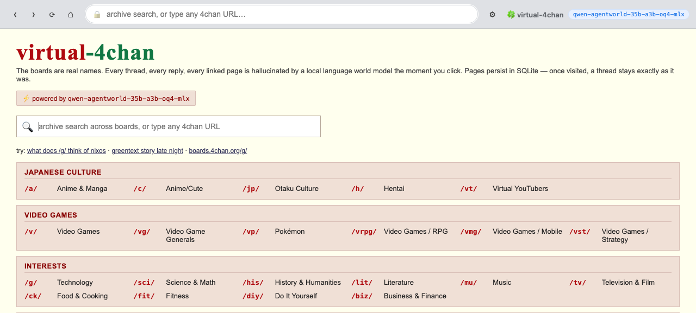

# 🍀 virtual-4chan

**A 4chan-shaped anonymous imageboard, hallucinated on the fly by a local language world model.**

> Click a board → the model writes the catalog. Click a thread → it writes the OP and 30–80 replies. Click any link inside → it writes the next page. Forever. Nothing is fetched from the real 4chan; the entire site is generated, click by click, by one local model — and persists in SQLite as you browse.



[](LICENSE)
[](https://nodejs.org/)
[](https://arxiv.org/abs/2606.24597)

---

## What this is

A browseable, persistent, fully simulated 4chan that runs on **one local model**. The home page lists the real 4chan board codes (`/g/`, `/v/`, `/a/`, `/pol/`, `/lit/`, `/mu/`, `/sci/`, `/fit/`, `/ck/`, …). Every catalog and every thread is generated the moment you click; once generated, it's cached in SQLite and stays exactly that way on every revisit. Threads have OPs with image placeholders, replies with `>greentext`, `>>postNo` quotelinks, fake 8-digit post numbers, `(ID: 8 hex)` on `/pol/` and `/int/`, the works.

It is a fork of **[hanxiao/qwen-agentworld-35b-a3b-web-simulator](https://github.com/hanxiao/qwen-agentworld-35b-a3b-web-simulator)** (Han Xiao's "LLM-as-Internet") — the same engine, narrowed to one site. Where that one hallucinates *any* page on *any* domain, this one hallucinates *only* `boards.4chan.org` and the handful of external sites a chan post would plausibly link to (Wikipedia, archives, Twitter, news, YouTube). The whole `/view` + `rewrite.ts` + SQLite-as-world plumbing comes directly from the upstream. See [Lineage](#lineage) below for the full credit chain.

---

## Why this works at all

Most "fake site" demos call a chat model and beg it to roleplay a page. This isn't that.

**[Qwen-AgentWorld-35B-A3B](https://arxiv.org/abs/2606.24597)** is not a chat model — it is a **Language World Model**, trained to predict `(state, action) → next observation` across 7 domains. Two of those domains are **Web** and **Search**. In the Web domain, the model's training task was literally *"given the current page and a navigation action, predict the destination browser state as a complete HTML document."* That is exactly what this app makes it do.

The result is far more coherent than chat-model roleplay: the model already knows what a browser state looks like, what an `<a href>` should point to, what a header/footer/nav of a real site looks like, how internal links should be consistent with the surrounding domain.

We just have to point it at the URL we want and render its prediction.

---

## How it works

```
                          ┌───────────────────────────┐
                          │  user clicks <a href=...>  │
                          └────────────┬──────────────┘
                                       │
                          ┌────────────▼──────────────┐
   /view?url=…&ctx=anchor │       fastify server       │
                          └────────────┬──────────────┘
                                       │
                          cache hit?   ▼
                          ┌────────────────────────────┐
                yes ◄──── │   SQLite (node:sqlite)     │ ──── no
                          └────────────────────────────┘
                                                       │
                                       ┌───────────────▼───────────────┐
                                       │  prompts.ts builds:           │
                                       │  system = "Web World Model"   │
                                       │  user   = (url, action,       │
                                       │            page-genre, seed)  │
                                       └───────────────┬───────────────┘
                                                       │
                                       ┌───────────────▼───────────────┐
                                       │  LM Studio OpenAI-compat API  │
                                       │  qwen-agentworld-35b-a3b      │
                                       │  → streams HTML token by token│
                                       └───────────────┬───────────────┘
                                                       │
                                       ┌───────────────▼───────────────┐
                                       │  rewrite.ts:                  │
                                       │  • strip <script>             │
                                       │  • images → placeholders      │
                                       │  • every <a href> → /view?…   │
                                       │  • store in SQLite            │
                                       └───────────────┬───────────────┘
                                                       │
                                       ┌───────────────▼───────────────┐
                                       │  sandboxed iframe renders it  │
                                       └────────────────────────────────┘
```

- **One model, three jobs.**
  - `/search` simulates a chan-archive `web_search` (structured JSON results across boards).
  - `/view` predicts a destination page as a full HTML document.
  - [`rewrite.ts`](src/rewrite.ts) rewrites every `<a href>` to `/view?url=…` (carrying anchor text as context). Any click recurses.
- **The cache is the world.** Pages persist in SQLite — a URL, once visited, stays byte-identical across revisits and restarts. Browsing accretes a consistent universe. To wipe and start over, delete `world.db`.
- **Thinking.** The model's chain-of-thought *is* its simulation mechanism. At ~30 tok/s locally it crowds out the page's token budget, so we suppress it by default (an assistant-prefill kill-switch) and stream fast. `THINKING=on` is an honest, inspectable opt-in; it ~doubles first-visit latency, cached revisits are unaffected.

~1100 lines of TypeScript. Two runtime dependencies (`fastify`, `node-html-parser`). No build step. Runs straight from `tsx`.

---

## Run

### Prerequisites

- **Node 20+**
- **An OpenAI-compatible chat endpoint serving the model.** Easiest path: [LM Studio](https://lmstudio.ai) → search *"agentworld"* in the model browser → download `qwen-agentworld-35b-a3b` (4-bit: ~20 GB VRAM is enough) → enable the local server.

### Install

```bash
git clone https://github.com/tak633b/virtual-4chan.git
cd virtual-4chan
npm install
```

### Configure (optional)

Defaults work for LM Studio on the default port. Override via `.env`:

```bash
cp .env.example .env
# edit if your endpoint differs
```

### Start

```bash
npm run dev          # → http://localhost:3000
```

Pick a board, then start clicking.

---

## Use any endpoint

Not running the model locally? Open **⚙ Settings** in the chrome and point the app at any OpenAI-compatible API — your own server, Ollama, OpenRouter, OpenAI. No restart needed.

| Provider | Base URL |
|---|---|
| LM Studio (local) | `http://127.0.0.1:1234/v1` |
| Ollama (local) | `http://127.0.0.1:11434/v1` |
| OpenRouter | `https://openrouter.ai/api/v1` |
| OpenAI | `https://api.openai.com/v1` |

The model name field accepts any model id the endpoint understands. Quality is best with the world model it was built for; the closer your fallback is to a strong base model with HTML training data, the better the pages will look.

---

## Configuration reference

All knobs live in `.env` and have sane defaults:

| Var | Default | Meaning |
|---|---|---|
| `LM_BASE_URL` | `http://127.0.0.1:1234/v1` | OpenAI-compatible endpoint |
| `MODEL` | `qwen-agentworld-35b-a3b-oq4-mlx` | model id |
| `PORT` | `3000` | HTTP port |
| `DB_PATH` | `./world.db` | SQLite path for the persistent universe |
| `WORLD_EPOCH` | `v1` | bump to fork a fresh universe; old pages stay under the old key |
| `THINKING` | `off` | `on` lets the world model reason before each page — higher fidelity, much slower |
| `PAGE_MAX_TOKENS` | `6000` | page budget when thinking=off |
| `PAGE_MAX_TOKENS_THINK` | `12000` | page budget when thinking=on |
| `SERP_MAX_TOKENS` | `2400` | archive-search budget |
| `GEN_TIMEOUT_MS` | `240000` | hard ceiling per page (thinking=off) |
| `GEN_TIMEOUT_MS_THINK` | `600000` | hard ceiling per page (thinking=on) |

---

## The simulated boards

The home page exposes the canonical 4chan board layout. The system prompt is conditioned per-board to match voice:

| Group | Boards |
|---|---|
| **Japanese Culture** | `/a/` `/c/` `/jp/` `/h/` `/vt/` |
| **Video Games** | `/v/` `/vg/` `/vp/` `/vrpg/` `/vmg/` `/vst/` |
| **Interests** | `/g/` `/sci/` `/his/` `/lit/` `/mu/` `/tv/` `/ck/` `/fit/` `/diy/` `/biz/` |
| **Creative** | `/ic/` `/po/` `/p/` `/3/` `/gd/` |
| **Other** | `/b/` `/pol/` `/int/` `/x/` `/trv/` `/k/` `/r9k/` |

Each board's voice is steered explicitly (e.g. `/g/` = technical-snarky, Terry Davis references, OS wars; `/lit/` = pretentious-literary; `/mu/` = genre snobbery; `/biz/` = crypto-pumping, real-estate cope). Type any URL directly into the address bar to leave the curated list and explore.

---

## Endpoints

| Method | Path | What |
|---|---|---|
| `GET` | `/` | board directory |
| `GET` | `/view?url=…` | render a (cached or freshly generated) page |
| `GET` | `/raw?url=…` | the raw cached HTML body served same-origin to the iframe |
| `GET` | `/search?q=…` | archive search shell |
| `GET` | `/stream/page?url=…` | SSE: generate a page, streaming progress + chunks |
| `GET` | `/stream/search?q=…` | SSE: generate a SERP, streaming progress + chunks |
| `GET` | `/settings` | endpoint / model / thinking config |
| `POST` | `/settings` | save config |
| `GET` | `/health` | model ping + world stats |

---

## Content notes & guardrails

This generates fictional posts in the *shape* of a 4chan thread. The system prompt has explicit instructions:

- **No slurs.** When typical chan jargon would punch sideways, soften to `anon` / `NPC` / `normie`. Keep the wit, lose the hate.
- **No real-person attacks.** Use fake IDs and anonymous handles.
- **No calls to violence. No doxxing.**

The world model also has its own safety training on top. That said: this is still LLM output. Pages can be off-tone, repetitive, or surface tropes that feel chan-but-cringe. Because the cache is seed-stable, a bad page stays bad on every revisit until you delete `world.db`.

If you publish this somewhere, **do not point it at an untrusted endpoint and an untrusted user at the same time.** This project is designed for personal browsing of a fictional site, not for hosting a service.

---

## Limitations

- **Speed.** First-visit page generation is bounded by your local LLM throughput. On a single MacBook M-series with 4-bit Qwen-AgentWorld, expect ~30–90s per page in fast mode, several minutes in `THINKING=on`. Revisits are instant.
- **No real images.** The model writes `` tags with descriptive alt text; we replace `src` with a generic placeholder. The chan vibe with image placeholders is missing the bulk of what real boards are.
- **No real cross-thread state.** The model has no memory of other threads it generated — coherence comes from URL hints and link-context, not from a real database of generated content.
- **Output mode quirks.** With `THINKING=off` we prefill `<!DOCTYPE html>\n<html lang="en">` to force HTML emission immediately. If the model insists on reasoning, the prefill suppresses it; some outputs may be truncated at the token cap (the parser handles the common cases).

---

## Lineage

This project did not invent the idea. It stands on a short, clear chain of prior work, and it would not exist without it:

1. **[jina-ai/node-serp](https://github.com/jina-ai/node-serp)** — *LLM-as-SERP* (Jina AI). The original "what if the search results page itself was a hallucination?" demo. Used a chat LLM (Gemini) to produce a single Google-style results page on demand. **This is where the core idea started.**

2. **[hanxiao/qwen-agentworld-35b-a3b-web-simulator](https://github.com/hanxiao/qwen-agentworld-35b-a3b-web-simulator)** — *LLM-as-Internet* (Han Xiao). Took LLM-as-SERP and extended it: instead of just the SERP, every link clicks through into a **freshly hallucinated destination page**, and every link *inside that page* recurses again — an infinite, self-consistent web. This is also where the project switched from a chat LLM to a proper Language World Model (Qwen-AgentWorld), which is what makes the page coherence work at all. **Most of the code in this repo — the `/view` route, `rewrite.ts`, `cache.ts` SQLite-as-world, the sandboxed iframe, the streaming page generator, the settings panel — is from this upstream. The fork only changes `prompts.ts`, `chrome.ts` (the home), package metadata, and the README.**

3. **virtual-4chan** (this repo). Same engine, narrowed from "the entire internet" to a single site: `boards.4chan.org`. The contribution is the per-board voice conditioning, the catalog/thread/index URL classifier, the 4chan-style home page, and the chan-archive search framing — plus content guardrails (no slurs, no real-person attacks, no doxxing) baked into the system prompt.

If you like this, **star the upstream first**. The core invention is theirs.

## Other acknowledgments

- The model: **Qwen-AgentWorld** — *Language World Models for General Agents* · [arXiv:2606.24597](https://arxiv.org/abs/2606.24597).
- Local runtime: **[LM Studio](https://lmstudio.ai)**.
- Sibling Japanese variant: **[tak633b/fake-5ch](https://github.com/tak633b/fake-5ch)** — same engine, 5ch-shaped.

---

## License

[MIT](LICENSE) — same as the upstream.
